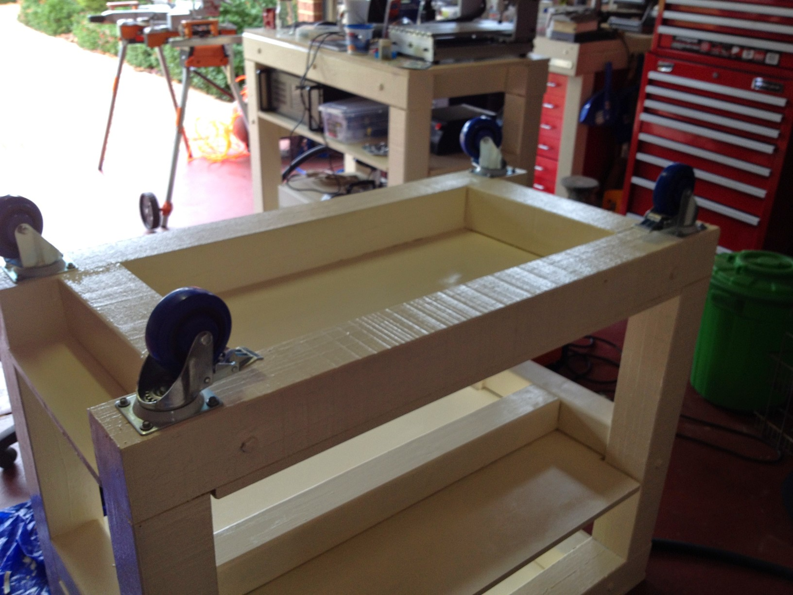

# Simple heavy mobile workbench
## Assembly of a very simple wood mobile workbench

Old Jarrah rescued from a delapilated veranda was used for some of the benches, pine posts for the rest.
Jarrah is hard and heavy, a beatifull wood, makes for a fine solid bench.

The final product in light duty use
  

## Materials
* Re-purposed Jarrah square poles 90x90
* New pine poles 90x90
* Many 12d 160 galvanised coach screws
* Many flat top hex screws for screwing down
* 900x600x22 MDF shelfs
* Roll of 600X3 rubber 
* Paint

## Screwing
Sturdy coach screws to keep it together. Long clamps to keep the shape, a rubber mallet for fine adjustments.

Countersink the top screws so they don't interfere with the flat top

Long 10mm drill bit for pilot holes for the structual coach screws. Note the clever use of isolation tape to mark max drill lenght. No need to overdo it, especially in Jarrah.

## The frame
Start by assembling the frame, get it true, clamp it down, true it up using the mallet. Use a square.

AssembLe the two sides first. Like above, on a flat surface. Lift them up and add the horizontal supports.
Don't crush other foot with Jarah beams.

Note the countersunk top screws. No need to countersink the bottom as the castors fit over them (for that brand).

True up and clamp down before drilling pilots.

## The tops
Once the structural members are in place add the MDF tops.
Screw down with countersunk flat top hex screws.

## Wheels
Heavy duty lockable castor wheels from bunnings

Castor wheels screwed in with coachscrews

## Finishes
Paint that shit up, don't be a little bitch.

